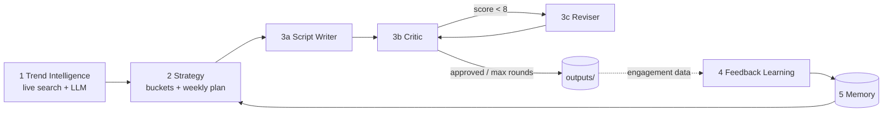

# Multi-Agent Instagram Growth Brain

LangGraph prototype: five agent layers plan, write, critique and learn.



## Run
```
pip install -r requirements.txt
cp .env.example .env   # add GROQ_API_KEY
python run.py plan --niche "AI & tech education creator"
python run.py feedback --simulate      # learn from engagement
python run.py plan                     # strategy now shifts toward winning buckets
```

## Outputs
`outputs/strategy.md|json` (buckets + weekly plan), `trends.json` (live trends),
`scripts_final.json`, `revision_history.json` (every critique and revision),
`data/memory.json` (what the system learned).

## Notes
Critic loop runs up to 2 revisions. Feedback score = (likes + 2*comments + 3*saves + 3*shares) / views per bucket.
